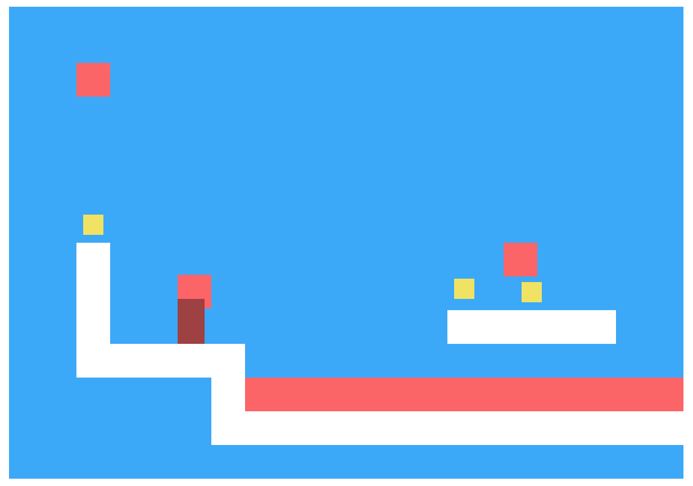

Проект курса JavaScript
===

В рамках дипломного проекта реализованы ключевые компоненты игры. Игра запускается и работает в браузере.

Игра после реализации имеет следующий интерфейс:

На иллюстрации вы можете видеть:
- Белые стены препятствий.
- Красные огненные шары и лаву.
- Желтые монетки.
- Игрока бордового цвета, потому что в данный момент он умер от столкновения с огненным шаром.

Игрок управляется стрелками с клавиатуры. Основная цель каждого уровня — собрать все монетки.

## Тестирование

В файле `./test/index.html` настроена среда автоматизированного тестирования `game.js` кода. Она проверяет созданные компоненты на соответствие требованиям. И если находит расхождения, сообщает об ошибке. Тем самым, тесты — навигатор, показывающий, какая часть требований в коде вы выполнена, а какая нет.

По тестам можно осуществлять навигацию. Можно выбрать конкретный компонент или конкретный метод и следить за выполнением только выбранных тестов, не отвлекаясь на другие.

Также можно отобразить только проваленные тесты или наоборот, только успешные.
